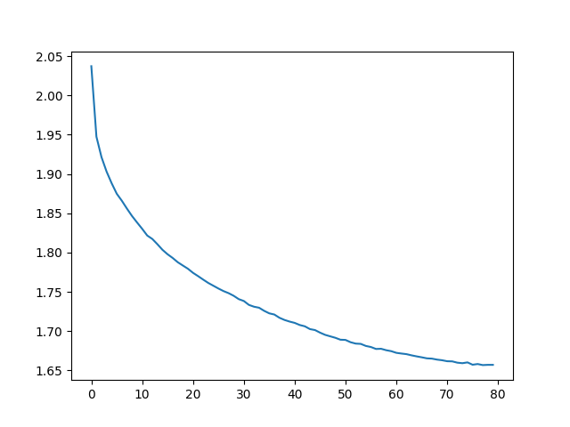
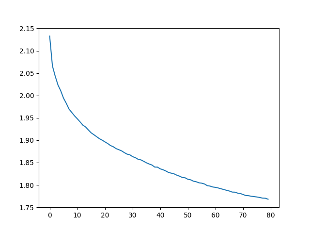
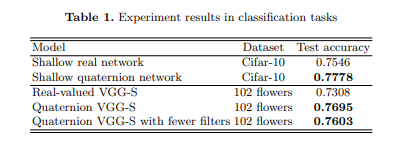
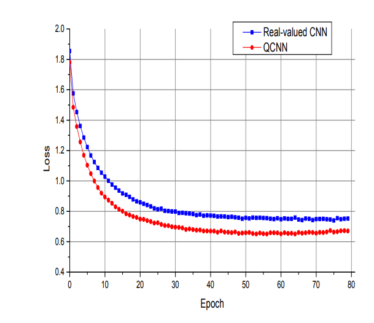

# Different runs of our model

## QCNN Cifar-10
Below the results of our cifar-10 are shown ran with the QCNN

### 42.2800%
Achieved using normalization of one and no filliping horizontal flipping int test set

### 73.14% paper architecture QCNN
Model without dropout, normal fullyconnected layers ad proposed in the paper and no normalization: 

If we want to load the data of this model, it is called: 28_18_5_29_As_proposed_in_the_paper 

It seems while running that the normal fully connected layers are performing better.

## CNN Cifar-10
Below the results of our cifar-10 are shown ran with the CNN

### 60.3100% 
Normal CNN with excact as many filters as the QCNN and twice as few parameters: 

# Discussion

The table that needs to be repoduces is depicted below. However our test results seem to diverge from this table. We are wondering if it is smart to keep on trying to achieve the 0.77 for the QCNN and 0.75 CNN or that it is smart to try and move on to the larger dataset.

We were also wondering why it seems that our CNN performs so much worse and looking at our graphs vs those in the paper down below, our loss does not match at all, and we learn slower.

